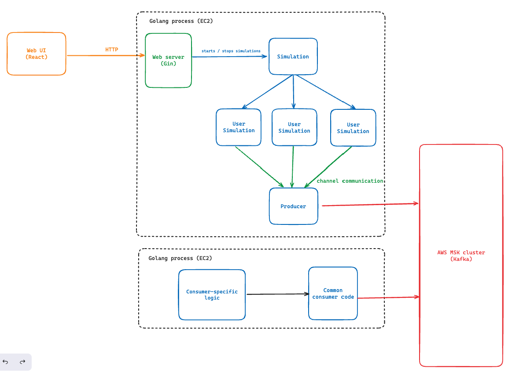

# Streaming simulation

This repository contains code and configuration to deploy a lightweight simulation of data streamed into a Kafka cluster on AWS MSK. It uses:
 - Go (with [Confluent Kafka client](https://github.com/confluentinc/confluent-kafka-go) and [Gin](https://github.com/gin-gonic/gin))
 - PostgreSQL
 - Docker (to run locally)
 - Terraform
 - AWS
 - React (a small webapp to interact with the simulation)

## Setup

Setup the AWS infrastructure using Terraform:

```
cd terraform/

terraform init
terraform apply
```

## Usage (backend server)

With Docker (runs the webserver and a local DB):

```
docker-compose up
```

Without Docker:

```
go run cmd/web/main.go
```

Alternatively, run commands (without the web server):

```
go run . generate-user-ids
```

```
go run . start
```

## Start the frontend web UI

```
cd web/
npm start
```

## Overall architecture



## Implementation choices

* The main module is independent of the Kafka producer logic – it communicates any generated events using a channel. In theory this means the project is easy to adapt to a different data layer than Kafka, for example by just saving everything into a DB.

* The semi-random 'user' activity is implemented with a finite state machine [using the fsm library](https://github.com/looplab/fsm). The event data is generated according to the event name and historic events for a given 'user'

* The frontend communicates with the HTTP API (implemented with Gin) over REST endpoints to interact with the simulation, e.g to add/stop/resume 'users' activity.